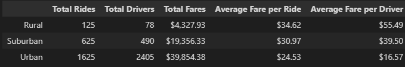

# PyBer_Analysis

## Overview of PyBer_Analysis:
#### V. Isualize, CEO of PyBer, has asked us to create and visualize a DataFrame if the ride sharing data by city type. This will help PyBer decide where to allocate resources.


## Resources:
Data Source: city_data.csv, ride_data.csv<br>
Software: Python 3.7, Anaconda 4.14.0, Jupyter Notebook 6.4.12
<br>
<br>
## PyBer_Analysis Results:


### <u>Ride-sharing Data by City Type</u>

In order to better understand the relationship between the different ride-sharing data and city types we need to first merge the two csv files(city_data.csv, ride_data.csv) and create a new DataFrame that we call "pyber_data_df."

```
pyber_data_df = pd.merge(ride_data_df, city_data_df, how="left", on=["city", "city"])
```
Doing so will allow us to create a summary DataFrame that will show us ride-sharing data that includes total rides, total drivers, total fares by city type, average fare per ride and driver.


  
As can be seen in the picture above, there are fewer total rides, total drivers, and total fares in rural areas. However, the average fare per ride and driver is higher than in Suburban and Urban areas. 

Rural areas are usually less populated, resulting in fewer people requesting a ride.
While rural areas may be less profitable for PyBer due to the lowest amount of total fares, urban cities are making the most money. 

### <u>Multiple-line Chart</u>
This can also be observed in the following multiple-line chart of total fares for each city type:


The multi-line chart shows us the total fares for each city type from 2019-01-01 through 2019-04-28 on a weekly basis. The graph is very similar to what we have seen in the PyBer Summary DataFrame. Urban cities earn the most while rural cities are barely making any money. Suburban cities seem to be in the middle, meaning that there is demand just not high enough. This could be a potential area to revisit when it comes to profitability.

## Summary:
Urban cities are without a doubt the most profitable for PyBer. However, there are 3 things PyBer could do to improve the disparity between city types:

1.  Rural areas should be advertised to drivers as highly profitable due to their high average fare per ride and driver. The drives may be longer than in urban and suburban cities, however, this should not discourage drivers from driving in rural areas. Gaining more drivers should be one of the priorities.

2. Suburban areas are the place PyBer should invest as much as possible. Maybe even have a program that allows people on a monthly subscription basis to be able to share rides between work/home or city/home. 

3. Since urban cities already have tons of drivers, PyBer should take a closer look at how long trips take and how far the trip distance is. Analyzing this data should give better insight into whether or not drivers operate efficiently. The more optimized the route and less driving the driver has to do, the better and quicker the trip. This will result in PyBer being able to increase their total amount of fares within the urban city.
